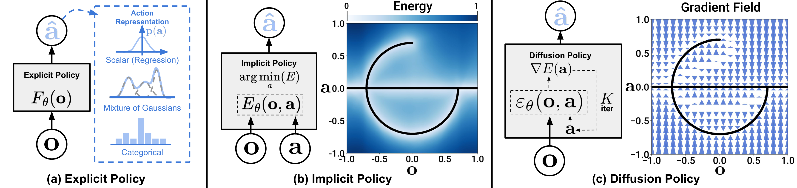

# IL-01：Diffusion Policy 基线

**类型：** 模仿学习 | **触觉支持：** ✗ | **适用任务：** T01, T02, T03

---

## 架构图

**Diffusion Policy 策略表示对比**

---

## 原始工作

- 论文：[Diffusion Policy: Visuomotor Policy Learning via Action Diffusion](https://arxiv.org/abs/2303.04137)（Chi et al., 2023）
- 代码：[real-stanford/diffusion_policy](https://github.com/real-stanford/diffusion_policy)
- 项目主页：[diffusion-policy.cs.columbia.edu](https://diffusion-policy.cs.columbia.edu/)

---

## 核心思路

Diffusion Policy 将**去噪扩散概率模型（DDPM）**应用于机器人动作生成，将动作序列的生成建模为迭代去噪过程。

**关键设计：**
- **观测编码：** RGB 图像（ResNet 提特征）+ 关节状态
- **动作表示：** Action chunk（预测未来 T_p 步的动作序列）
- **去噪网络：** U-Net 或 Transformer 结构
- **推理：** DDIM 加速采样，通常 10–20 步

**优势：** 可建模多模态动作分布（同一观测对应多种合理动作），对接触丰富任务尤为有效；相比 BC + MSE loss 显著提升。

---

## 在 DexBench 中的适配

| 设置 | 说明 |
|------|------|
| 仿真环境 | Isaac Lab / MuJoCo |
| 示范数据 | 仿真遥操作 / IL-05（DexMimicGen）合成 |
| 适用任务 | T01（抓取）、T02（重定向）、T03（传递）|

作为 IL 方法的基准线，IL-02（反应式）和 IL-03（流匹配）均在此基础上改进。

---

## 参考资料

- Chi, C., et al. (2023). *Diffusion Policy: Visuomotor Policy Learning via Action Diffusion*. arXiv:2303.04137.
