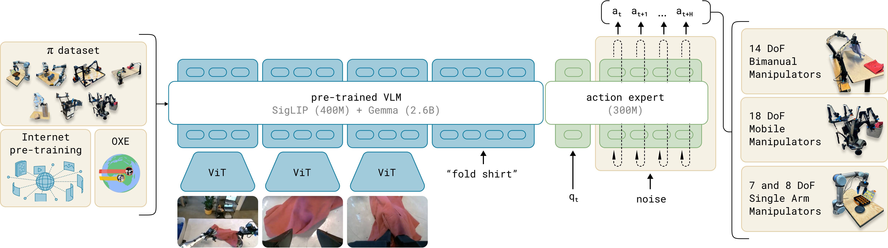

# IL-03：流匹配策略

**类型：** 模仿学习 | **触觉支持：** 可选 | **适用任务：** T04, T11

---

## 架构图

**π0 VLA-流匹配模型架构**

---

## 原始工作

- 流匹配基础：[Flow Matching for Generative Modeling](https://arxiv.org/abs/2210.02747)（Lipman et al., 2022）
- 机器人应用：[π0: A Vision-Language-Action Flow Model for General Robot Control](https://arxiv.org/abs/2410.24164)（Black et al., 2024）
- π0 代码：[physical-intelligence/openpi](https://github.com/physical-intelligence/openpi)

---

## 核心思路

**流匹配 vs. 扩散：** 流匹配用连续常微分方程（ODE）直接学习从噪声到数据的最优传输路径，推理只需 **1–2 步**（相比扩散的 10–20 步），适合高频接触控制。

**一致性流训练：**
1. 在训练数据上学习从高斯噪声到动作分布的直线流（Rectified Flow）
2. 用一致性目标（Consistency Training）保证任意推理步数下质量一致
3. 推理时 1 步即可生成高质量动作

**控制频率目标：** ≥ 50 Hz（相比扩散策略 ~10 Hz），适合精密插接（T04）等对延迟敏感的任务。

---

## 在 DexBench 中的适配

| 设置 | 说明 |
|------|------|
| 仿真环境 | MuJoCo / Isaac Lab |
| 适用任务 | T04（高频接触控制）、T11（长时程，对推理延迟敏感）|
| 对照实验 | 与 IL-01（扩散策略）在 T04 上对比推理速度与策略质量的权衡 |

---

## 参考资料

- Lipman, Y., et al. (2022). *Flow Matching for Generative Modeling*. arXiv:2210.02747.
- Black, K., et al. (2024). *π0: A Vision-Language-Action Flow Model for General Robot Control*. arXiv:2410.24164.
