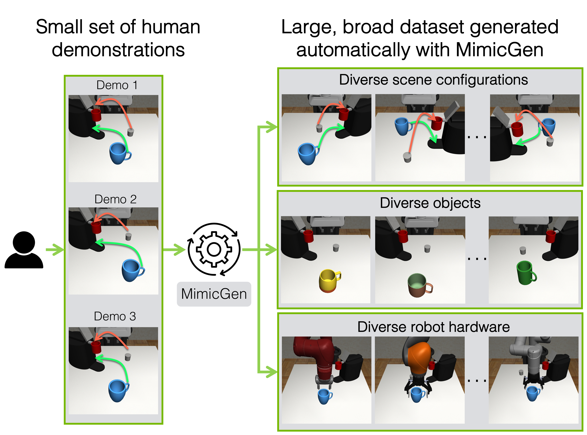

# IL-05：DexMimicGen + BC

**类型：** 模仿学习 | **触觉支持：** ✗ | **适用任务：** T01, T03, T11

---

## 架构图

**MimicGen 数据合成系统**

---

## 原始工作

- MimicGen 论文：[MimicGen: A Data Generation System for Scalable Robot Learning using Human Demonstrations](https://arxiv.org/abs/2310.17596)（Mandlekar et al., 2023）
- MimicGen 代码：[NVlabs/mimicgen](https://github.com/NVlabs/mimicgen)
- DexMimicGen：MimicGen 在灵巧手场景的适配版（本仓库实现，详见 `methods/il/IL-05/`）

---

## 核心思路

**问题：** 灵巧手操控示范数据采集成本极高（遥操作设备复杂、操作员学习周期长）。

**MimicGen 数据合成流程：**
1. **少量人工示范：** 采集约 10–50 条高质量人工演示
2. **子任务分解：** 自动将示范分解为若干子段（接近、抓取、放置等）
3. **仿真重组：** 对新的物体位置/场景，自动将子段轨迹迁移并重组为完整示范
4. **数据过滤：** 仿真验证筛选成功的合成示范（典型扩增比 1:50 以上）
5. **BC 训练：** 在大量合成示范上训练行为克隆策略

**DexMimicGen 适配灵巧手：** 额外处理高自由度手指轨迹的迁移，避免碰撞和奇异构型。

---

## 在 DexBench 中的适配

| 设置 | 说明 |
|------|------|
| 仿真环境 | Isaac Lab / MuJoCo |
| 示范来源 | 人工遥操作（~20 条）→ 合成（~1000 条）|
| 策略网络 | Diffusion Policy（IL-01）或 Transformer BC |
| 适用任务 | T01、T03、T11（多子任务场景尤其受益）|
| 对照实验 | 与 IL-01（直接 BC）对比，量化数据合成对样本效率的提升 |

---

## 参考资料

- Mandlekar, A., et al. (2023). *MimicGen: A Data Generation System for Scalable Robot Learning using Human Demonstrations*. arXiv:2310.17596.
