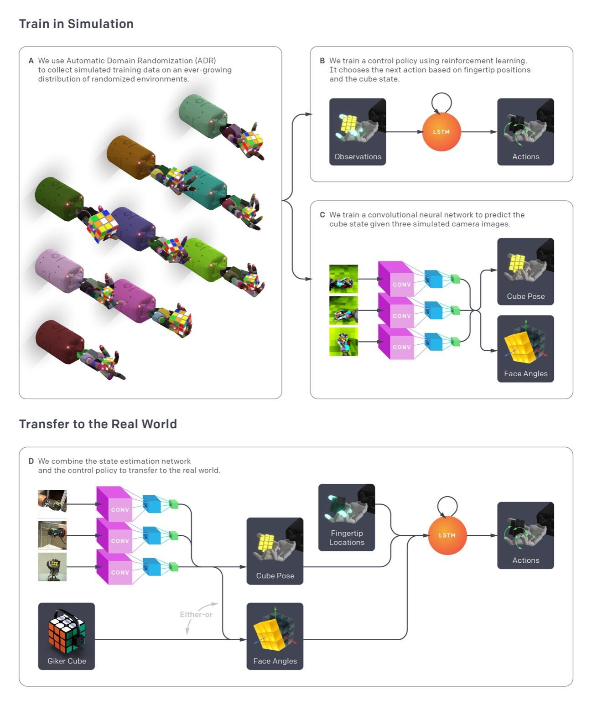
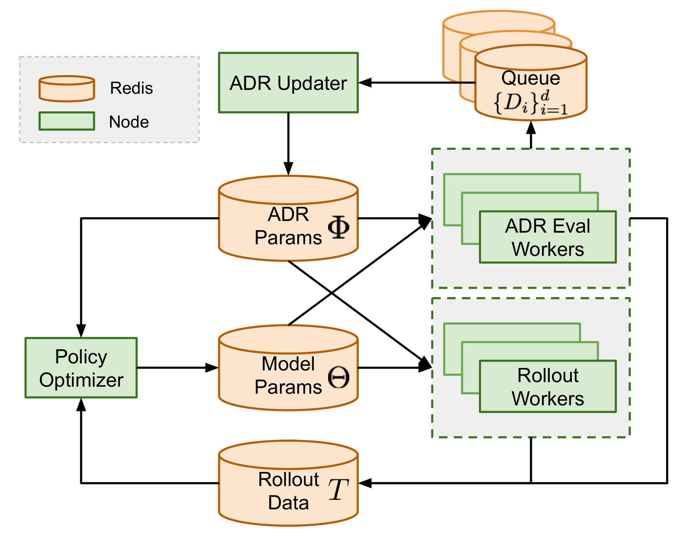

# RL-02：PPO + ADR（自动域随机化）

**类型：** 强化学习 | **触觉支持：** ✗ | **适用任务：** T01, T09

---

## 架构图

**系统概览**

**分布式 ADR 架构**

---

## 原始工作

- 论文：[Solving Rubik's Cube with a Robot Hand](https://arxiv.org/abs/1910.07113)（Akkaya et al. / OpenAI, 2019）
- ADR 方法概述：[OpenAI Dactyl 博客](https://openai.com/research/learning-dexterity)

---

## 核心思路

在标准 PPO 基础上引入**自动域随机化（Automatic Domain Randomization, ADR）**：动态调整仿真参数（摩擦系数、物体质量、关节阻尼、感知噪声等）的随机化范围，使策略在逐渐扩大的参数空间中保持鲁棒性。

**ADR 机制：**
1. 初始化时仿真参数范围很窄（接近固定值）
2. 若策略在当前范围内成功率超过上阈值，则扩大随机化范围
3. 若成功率低于下阈值，则缩小范围
4. 收敛后策略对大范围参数变化具有鲁棒性

**目标：** 提升跨手型（T09）和跨物体的泛化能力。

---

## 在 DexBench 中的适配

| 设置 | 说明 |
|------|------|
| 仿真环境 | Isaac Lab |
| 适用任务 | T01（与 RL-01 对比泛化差异）、T09（跨手型迁移）|
| 随机化参数 | 摩擦系数、物体质量、关节阻尼、传感器噪声、物体初始位姿 |

ADR 是 T09 跨手型迁移实验的重要基线之一，与 RL-03（RMA）构成对比：ADR 靠扩大分布覆盖面应对变化，RMA 靠在线适配。

---

## 参考资料

- Akkaya, I., et al. (2019). *Solving Rubik's Cube with a Robot Hand*. arXiv:1910.07113.
