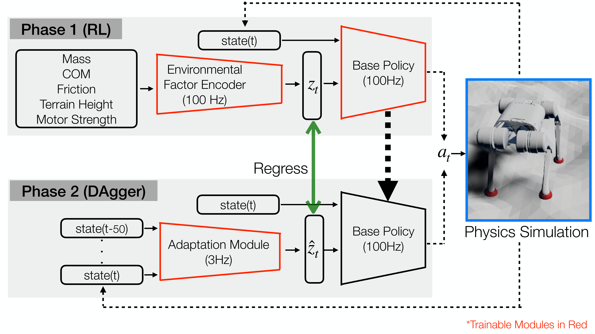

# RL-03：RMA 在线适配

**类型：** 强化学习 | **触觉支持：** ✗ | **适用任务：** T02, T09

---

## 架构图

**RMA 两阶段训练与部署架构**

---

## 原始工作

- 论文：[RMA: Rapid Motor Adaptation for Legged Robots](https://arxiv.org/abs/2107.04034)（Kumar et al., 2021）
- 代码：[antonilo/rl_locomotion](https://github.com/antonilo/rl_locomotion)（腿足版本；灵巧手适配见本仓库 `methods/rl/RL-03/`）

---

## 核心思路

RMA 是一种**两阶段训练的在线适配框架**，核心思路是用特权信息训练教师策略，再蒸馏到只用历史本体感知的学生策略。

**阶段一：特权信息训练**
- 教师网络可访问仿真中的精确环境参数（摩擦系数、手型参数、物体质量等）
- 用标准 RL 训练含特权编码器的教师策略

**阶段二：学生网络蒸馏**
- 学生网络只能访问历史本体感知数据（关节角、速度序列）
- 通过监督学习让学生隐层表示匹配教师的特权编码
- 部署时：学生网络在线推断环境参数，无需显式标定

**与 ADR（RL-02）的区别：** ADR 靠扩大随机化范围提升鲁棒性；RMA 靠在线推断环境参数实现自适应，推理阶段计算量更低。

---

## 在 DexBench 中的适配

| 设置 | 说明 |
|------|------|
| 仿真环境 | Isaac Lab |
| 适用任务 | T02（手内重定向）、T09（跨手型迁移）|
| 特权信息 | 手型关节参数、物体质量/摩擦、精确接触状态 |

T09 跨手型实验：与 RL-02（ADR）、IL-04（FAAS）共同构成完整的跨手型方法对比。

---

## 参考资料

- Kumar, A., et al. (2021). *RMA: Rapid Motor Adaptation for Legged Robots*. arXiv:2107.04034.
