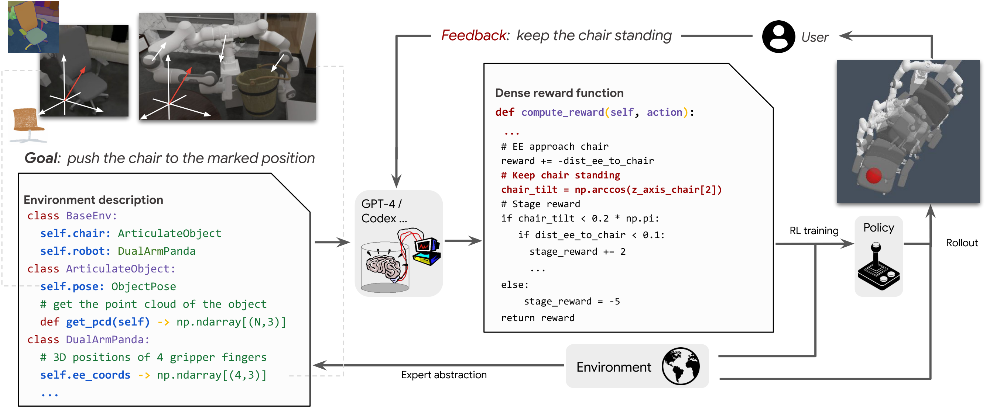
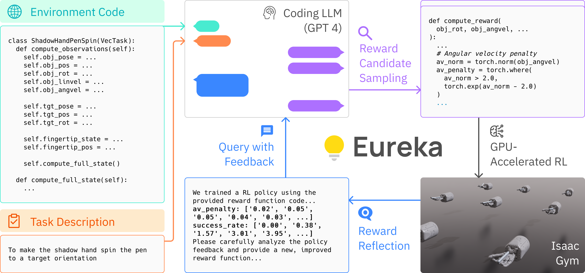

# RL-04：触觉奖励塑形 RL

**类型：** 强化学习 | **触觉支持：** ✓ | **适用任务：** T04, T05, T07

---

## 架构图

**Text2Reward 框架**

**Eureka 概述**

---

## 原始工作

本方法受 **Text2Reward / Eureka** 范式启发，用 LLM 自动生成触觉相关奖励函数。

- Text2Reward：[Text2Reward: Reward Shaping with Language Models for Reinforcement Learning](https://arxiv.org/abs/2309.11489)（Xie et al., 2023）
- Eureka：[Eureka: Human-Level Reward Design via Coding Large Language Models](https://arxiv.org/abs/2310.12931)（Ma et al., 2023）
- Eureka 代码：[eureka-research/Eureka](https://github.com/eureka-research/Eureka)

---

## 核心思路

**动机：** 精密插接（T04）、拧紧（T05）、滑动检测（T07）等任务中，纯稀疏奖励导致探索极为困难。触觉信号提供了丰富的接触状态信息，可用于设计密集奖励。

**流程：**
1. **LLM 奖励生成：** 给定任务描述和触觉传感器接口，用 LLM（如 GPT-4）生成候选奖励函数（Python 代码）
2. **奖励筛选：** 在仿真中快速验证候选函数（检查梯度方向、量级合理性）
3. **PPO 训练：** 用筛选后的密集触觉奖励 + 稀疏成功奖励训练策略
4. **触觉观测：** 将触觉传感器读数（压力分布、接触力向量）加入观测空间

**触觉奖励示例（T04 精密插接）：**
- 接触对称性奖励（手指受力均匀分布）
- 接触力幅值奖励（力在合理范围内，不过载）
- 插接方向对齐奖励（法向力与目标插入方向一致）

---

## 在 DexBench 中的适配

| 设置 | 说明 |
|------|------|
| 仿真环境 | Isaac Lab / MuJoCo |
| 适用任务 | T04（精密插接）、T05（拧紧）、T07（滑动检测）|
| 触觉传感器 | 仿真压力场（详见 `tactile/` 模块）|
| 对照实验 | 与 RL-01（稀疏奖励，无触觉）对比触觉增益 |

---

## 参考资料

- Xie, T., et al. (2023). *Text2Reward: Reward Shaping with Language Models for Reinforcement Learning*. arXiv:2309.11489.
- Ma, Y., et al. (2023). *Eureka: Human-Level Reward Design via Coding Large Language Models*. arXiv:2310.12931.
