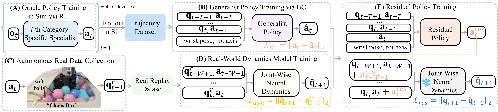

# RL-06：DexNDM 关节校准

**类型：** Sim-to-Real 校准工具（可与任意 RL/IL 方法组合）| **触觉支持：** ✗ | **适用任务：** T09

---

## 架构图

**DexNDM 框架**

---

## 原始工作

- DexNDM 原始论文：*TODO — 补充论文链接*
- 本仓库 Acknowledgements 中提及

---

## 核心思路

**问题背景：** 不同品牌灵巧手（Inspire、Allegro、Shadow 等）存在关节级动力学误差：相同控制指令在仿真与实机上产生不同轨迹，这种误差在跨手型实验（T09）中尤为突出。

**DexNDM 方法：**
1. **数据采集：** 在目标灵巧手上执行一批随机控制序列，录制真实关节轨迹（数据量少，约 1000 条）
2. **误差建模：** 用神经网络拟合仿真轨迹与真实轨迹之间的残差（关节级神经动力学误差模型，NDM）
3. **仿真校准：** 将误差模型以 wrapper 形式插入仿真 pipeline，使仿真动力学更贴近真实硬件
4. **即插即用：** 校准后的仿真可直接供任意 RL/IL 方法使用，无需修改策略架构

**数据效率：** 每种手型只需少量真实数据，采集成本低；校准后可在仿真中大量训练。

---

## 在 DexBench 中的适配

| 设置 | 说明 |
|------|------|
| 适用场景 | T09 跨手型迁移的 sim-to-real 校准阶段 |
| 校准目标 | Inspire RH56、Allegro Hand v4、Shadow Hand |
| 接口 | 作为 wrapper 插入 Isaac Lab 仿真环境（详见 `envs/` 模块）|

DexNDM 是 DexBench 中唯一专注于关节级动力学校准的模块，可与 RL-02（ADR）、RL-03（RMA）等方法叠加使用。

---

## 参考资料

- *TODO — 补充 DexNDM 原始论文引用*
